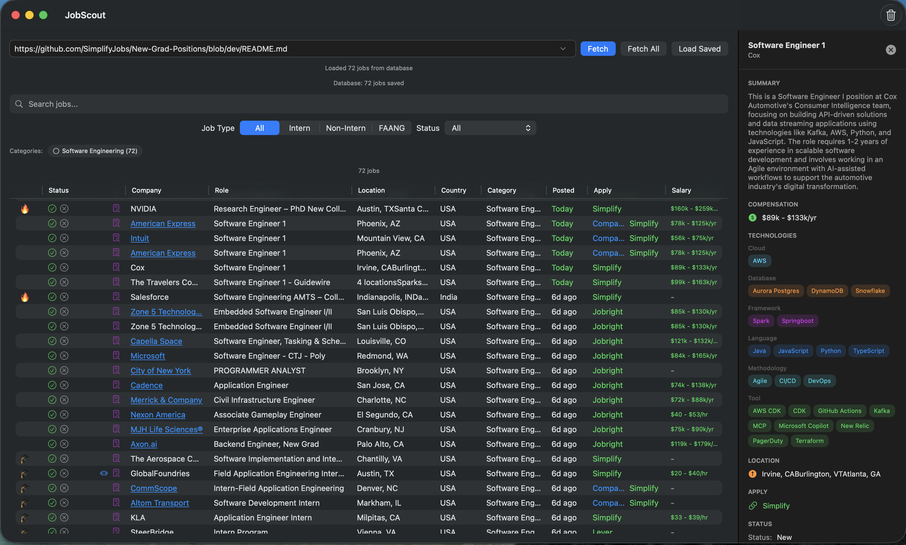

# JobScout

A macOS app for aggregating and tracking job postings from GitHub-based job boards.

<p align="center">
  
</p>

## Overview

JobScout fetches job listings from GitHub README files (like SimplifyJobs and Jobright repositories), parses the markdown tables, and provides a unified interface for browsing, filtering, and tracking your job application progress.

## Features

### Job Aggregation
- Fetches job postings from GitHub README files containing markdown tables
- Parses multiple table formats automatically
- Supports popular job boards:
  - [SimplifyJobs New-Grad-Positions](https://github.com/SimplifyJobs/New-Grad-Positions)
  - [SimplifyJobs Summer Internships](https://github.com/SimplifyJobs/Summer2026-Internships)
  - [Jobright 2026 Software Engineer New Grad](https://github.com/jobright-ai/2026-Software-Engineer-New-Grad)

### Data Harmonization
- AI-powered category inference using OpenRouter API (optional)
- Automatic date normalization (relative dates like "2d ago" → ISO format)
- Smart link classification (company vs. aggregator links)
- Detects FAANG companies and internship positions

### Job Tracking
- Mark jobs as **Applied** or **Ignored** with timestamps
- Track when you last viewed a job posting
- Filter by status: All, New Only, Applied, Ignored, Exclude Applied/Ignored
- Filter by job type: All, Intern, Non-Intern, FAANG

### Full-Text Search
- Powered by SQLite FTS5 with trigram tokenizer for substring matching
- Searches across all job fields: company, role, summary, technologies, salary, location
- BM25 ranking for relevance-based results (company/role weighted highest)
- Keyword highlighting in search results and job details panel
- Debounced search for responsive performance
- Automatic index synchronization via database triggers

### User Interface
- Clean, native macOS interface built with SwiftUI
- Sortable table with company, role, location, category, and dates
- Clickable company names linking to company websites
- Quick access to apply links (both company and aggregator)
- URL history dropdown for quick access to saved sources
- Category filter chips for quick filtering
- Inspector panel showing job details with search highlighting

### Persistence
- SQLite database for storing job postings
- Tracks job sources with last-fetched timestamps
- Preserves user status (applied/ignored) across sessions
- Secure API key storage in macOS Keychain

## Requirements

- macOS 14.0 (Sonoma) or later
- Xcode 16.0 or later (for building)
- OpenRouter API key (optional, for AI harmonization)

## Installation

1. Clone the repository:
   ```bash
   git clone https://github.com/iliasaz/JobScout.git
   cd JobScout
   ```

2. Open in Xcode:
   ```bash
   open JobScout.xcodeproj
   ```

3. Build and run (⌘R)

## Configuration

### OpenRouter API Key (Optional)

To enable AI-powered data harmonization:

1. Get an API key from [openrouter.ai/keys](https://openrouter.ai/keys)
2. Open JobScout → Settings (⌘,)
3. Enter your API key and click Save

### Settings

- **Enable AI Harmonization**: Toggle AI-powered category inference
- **Maximum rows to ingest**: Limit the number of jobs parsed (0 = no limit)

## Usage

1. **Fetch Jobs**: Enter a GitHub README URL and click "Fetch"
2. **Save Jobs**: Click "Save" to persist jobs to the database
3. **Load Saved**: Click "Load Saved" to view previously saved jobs
4. **Track Progress**: Use ✓ and ✗ buttons to mark jobs as applied/ignored
5. **Filter**: Use the status and category filters to narrow results
6. **Apply**: Click company or aggregator links to open job applications

## Architecture

```
JobScout/
├── Agent/              # AI agent for job analysis
├── Database/           # SQLite database models and migrations
├── Harmonization/      # Data normalization and link classification
├── Models/             # Core data models (JobPosting, ParsedTable)
├── Parsers/            # Markdown table parsing
├── Repositories/       # Data access layer
├── Services/           # Keychain, logging, URL history
├── Tools/              # Parsing utilities
└── Views/              # SwiftUI views
```

## Dependencies

- [GRDB.swift](https://github.com/groue/GRDB.swift) - SQLite database
- [SwiftAgents](https://github.com/iliasaz/SwiftAgents) - AI agent framework
- [html2md](https://github.com/tim-gromeyer/html2md) - HTML to Markdown conversion
- [swift-structured-queries](https://github.com/pointfreeco/swift-structured-queries) - Type-safe SQL

## License

MIT License - see LICENSE file for details.
